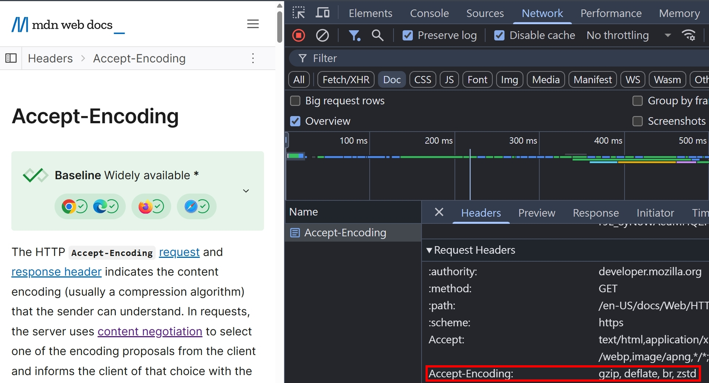

### Accept-Encoding

當我們使用瀏覽器打開任何一個網頁時，F12 > Network > Doc > Request Headers，應該都可以看到 `Accept-Encoding`

這是瀏覽器預設就會發送的 Request Header，代表瀏覽器支援這些資料壓縮的方法

<!-- todo-yusheng 可能跟 content-negotiation 主題類似 -->

### Compression

資料的壓縮通常分為兩種

1. Loss-less compression（無損壓縮）
2. Lossy compression (破壞性資料壓縮)

### 參考資料
- https://developer.mozilla.org/en-US/docs/Web/HTTP/Compression
- https://developer.mozilla.org/en-US/docs/Glossary/Lossless_compression
- https://developer.mozilla.org/en-US/docs/Glossary/Lossy_compression
- https://developer.mozilla.org/en-US/docs/Glossary/Brotli_compression
- https://developer.mozilla.org/en-US/docs/Glossary/gzip_compression
- https://developer.mozilla.org/en-US/docs/Glossary/Zstandard_compression
- https://developer.mozilla.org/en-US/docs/Web/HTTP/Guides/Compression_dictionary_transport
- https://developer.mozilla.org/en-US/docs/Web/HTTP/Headers/Content-Encoding
- https://developer.mozilla.org/en-US/docs/Web/HTTP/Headers/Accept-Encoding
- https://developer.mozilla.org/en-US/docs/Glossary/Quality_values
- https://nodejs.org/docs/latest-v22.x/api/zlib.html