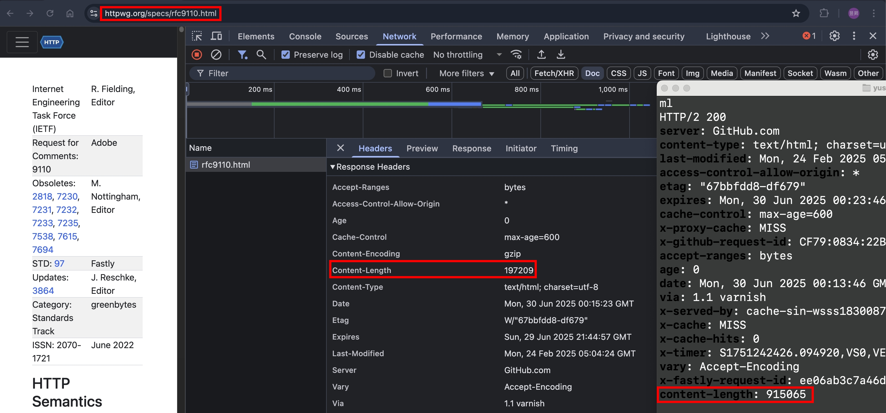

## 前言

我們平常 RESTFUL API 會用到的 HTTP Request Methods 就 GET, POST, PUT, PATCH, DELETE

- GET: 取資料
- POST: 新增資料
- PUT: 更新資料
- PATCH: 部分更新資料
- DELETE: 刪除資料

但，今天我想要深入理解，平常不會去使用那些 HTTP Request Methods，一起來看看吧！

## HEAD

- 簡單理解：同 GET 請求，只是把 Response Body 拿掉
- 承上，如果 Response Body 有值，HTTP Client "MUST" 忽略它
- 使用情境：下載大型檔案前，先發一個 HEAD 請求，讀取 Response.Headers.Content-Length，就可以預先知道檔案大小
- 如果發了 HEAD 請求，Server 回傳說 "快取過期了"。此情況下，快取會被更新，即便 GET 請求沒有發送
- 承上，詳細的測試情境，我們放到未來的篇章 [http-caching](../http/http-caching-1.md)

### curl --head with third party static website testing

測試看看 `curl --head example.com`，結果如下

```zsh
HTTP/1.1 200 OK
Content-Type: text/html
ETag: "84238dfc8092e5d9c0dac8ef93371a07:1736799080.121134"
Last-Modified: Mon, 13 Jan 2025 20:11:20 GMT
Cache-Control: max-age=3457
Date: Mon, 30 Jun 2025 00:06:32 GMT
Connection: keep-alive
```

為什麼沒有回傳 `Content-Length` 呢？根據 [RFC9110 9.3.2. HEAD](https://httpwg.org/specs/rfc9110.html#rfc.section.9.3.2) 的描述：

```
However, a server MAY omit header fields for which a value is determined only while generating the content.
```

所以說，透過 HEAD 請求預先讀取 Response.Headers.Content-Length，其實不一定有效的

我們再來嘗試 `curl --head https://httpwg.org/specs/rfc9110.html`

可以看到 HEAD 請求跟 GET 請求回傳的 `Content-Length` 也不一樣


### curl --head with local static file

我們使用先前的文章 [http-range-requests#send-套件的實作](../http/http-range-requests.md#send-套件的實作) 介紹過的 `send` 套件來實作

index.ts

```ts
import send from "send";
import httpServer from "../httpServer";
import { faviconListener } from "../listeners/faviconListener";
import { notFoundListener } from "../listeners/notFoundlistener";

httpServer.on("request", function requestListener(req, res) {
  if (req.url === "/favicon.ico") return faviconListener(req, res);
  if (req.url === "/example.txt") {
    return send(req, String(req.url), { root: __dirname }).pipe(res);
  }
  return notFoundListener(req, res);
});
```

example.txt

```
helloworld
```

嘗試 `curl --head http://localhost:5000/example.txt`

```zsh
HTTP/1.1 200 OK
Accept-Ranges: bytes
Cache-Control: public, max-age=0
Last-Modified: Mon, 30 Jun 2025 00:33:43 GMT
ETag: W/"a-197be410daa"
Content-Type: text/plain; charset=utf-8
Content-Length: 10
Date: Mon, 30 Jun 2025 00:38:02 GMT
Connection: keep-alive
Keep-Alive: timeout=5
```

嘗試 `curl -v http://localhost:5000/example.txt`，擷取 response header，可以看到跟 HEAD 請求是一樣的

```zsh
< HTTP/1.1 200 OK
< Accept-Ranges: bytes
< Cache-Control: public, max-age=0
< Last-Modified: Mon, 30 Jun 2025 00:33:43 GMT
< ETag: W/"a-197be410daa"
< Content-Type: text/plain; charset=utf-8
< Content-Length: 10
< Date: Mon, 30 Jun 2025 00:39:38 GMT
< Connection: keep-alive
< Keep-Alive: timeout=5
```

我們來看看 `send` 套件關於 HEAD 請求的實作（節錄部分）：

```js
SendStream.prototype.send = function send(path, stat) {
  // other code...

  // content-length
  res.setHeader("Content-Length", len);

  // HEAD support
  if (req.method === "HEAD") {
    res.end();
    return;
  }

  this.stream(path, opts);
};
```

function 的上面已經把各種 Response Headers 都設定好了，最後要送出 Body 之前，檢查是否為 HEAD 請求，若是則直接調用 `res.end()`

我認為這個寫法很優美，並且也符合 Best Practice（HEAD 請求的 Response Headers 跟 GET 請求的一樣，只差在有沒有 Response Body）

### HEAD 小結

使用 HEAD 請求來獲取 `Content-Length`，影響的因素太多了，實務上：

- HTTP 請求通常不會直接打到 Application Server，中間都會過 Web Server, CDN, WAF 以及 Proxy 等等，中間每一層都有不同的機制去修改 HTTP Headers
- 但在 Application Server 這一層的實作，以 `send` 套件為例，確實是有 follow Best Practice
- 通常後端工程師在寫 RESTFUL API 的時候，不會特別實現 HEAD 請求的商業邏輯，決大部分都是各種 HTTP Framework, library 或是程式語言本身幫忙實現的

## CONNECT

## OPTIONS

## TRACE

## 參考資料

- https://developer.mozilla.org/en-US/docs/Web/HTTP/Reference/Methods/HEAD
- https://httpwg.org/specs/rfc9110.html#rfc.section.9.3.2
- https://developer.mozilla.org/en-US/docs/Web/HTTP/Reference/Methods/CONNECT
- https://developer.mozilla.org/en-US/docs/Web/HTTP/Reference/Methods/OPTIONS
- https://developer.mozilla.org/en-US/docs/Web/HTTP/Reference/Methods/TRACE
- https://fetch.spec.whatwg.org/#methods
