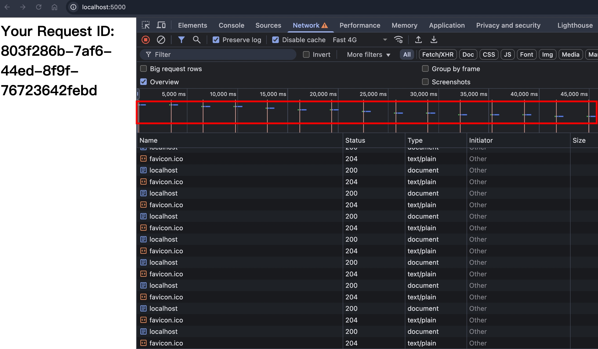
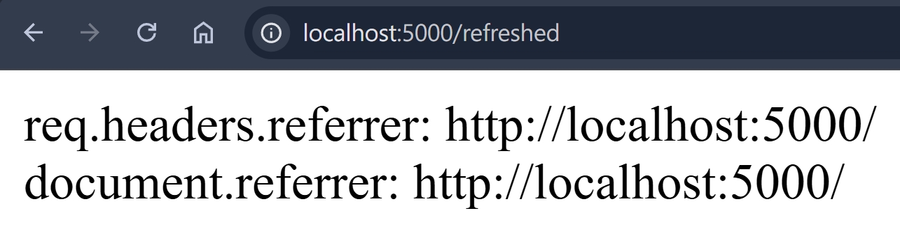

### Refresh Response Header

Refresh 是一個 Response Header，將用戶在 N 秒後導向指定頁面，語法是

```
Refresh: 0
Refresh: 1, url=https://www.google.com
Refresh: 2; url=https://developer.mozilla.org
```

若不指定 url 的話，則代表原頁重整

### Refresh without url

使用 NodeJS HTTP 模組實作

```ts
import httpServer from "../httpServer";
import { faviconListener } from "../listeners/faviconListener";
import { notFoundListener } from "../listeners/notFoundlistener";

httpServer.removeAllListeners("request");
httpServer.on("request", function requestListener(req, res) {
  if (req.url === "/favicon.ico") return faviconListener(req, res);
  if (req.url === "/") {
    res.setHeader("Refresh", "3");
    res.setHeader("Content-Type", "text/html");
    res.end(`<h1>Your Request ID: ${crypto.randomUUID()}</h1>`);
    return;
  }
  return notFoundListener(req, res);
});
```

瀏覽器打開 http://localhost:5000/ ，就可以看到每隔 3 秒刷新頁面的效果了


### referrer

根據 [MDN 文件](https://developer.mozilla.org/en-US/docs/Web/HTTP/Reference/Headers/Refresh)的描述

```
Note: When a refresh redirects to a new page, the Referer header is included in the request for the new page (if permitted by the Referrer-Policy), and document.referrer is set to the referrer URL after navigating.
```

我們來測試看看，調整 NodeJS 的程式碼

```ts
if (req.url === "/") {
  res.setHeader("Refresh", "0; url=https://localhost:5000/refreshed");
  res.setHeader("Content-Type", "text/html");
  res.end(`<h1>Your Request ID: ${crypto.randomUUID()}</h1>`);
  return;
}
if (req.url == "/refreshed") {
  res.setHeader("Content-Type", "text/html");
  res.end(`
    <html>
      <head></head>
      <body>
        <div>req.headers.referrer: ${req.headers.referer}</div>
        <div id="documentReferrer"></div>
        <script>
          document.getElementById("documentReferrer").innerText = "document.referrer: " + document.referrer
        </script>
      </body>
    </html>
  `);
  return;
}
```

瀏覽器打開 http://localhost:5000/ ，可以看到 referrer 確實有帶到


### Refresh with javascript protocol

### Redirection order of precedence

### 30x redirect vs refresh

### script redirect vs refresh

### meta refresh vs refresh

### 參考資料

- https://developer.mozilla.org/en-US/docs/Web/HTTP/Headers/Refresh
- https://developer.mozilla.org/en-US/docs/Web/HTTP/Guides/Redirections#order_of_precedence
