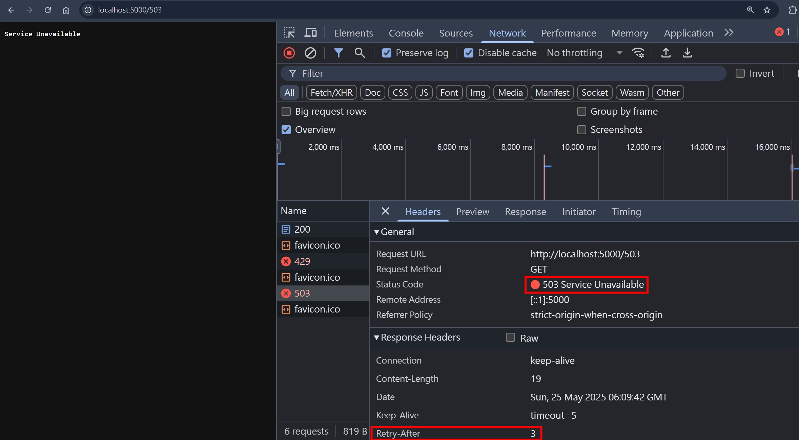

### Retry-After

Retry-After 是一個 HTTP Response Header，有兩種表達方式

1. `Retry-After: 3` => 3 秒後再請求一次
2. `Retry-After: Sat, 24 May 2025 10:57:26 GMT` => 請等到這個時間點再請求一次

其中，第二種表達方式，跟 `Date: Sat, 24 May 2025 10:57:26 GMT` HTTP Header 的格式一模一樣，都是 [UTCString](https://developer.mozilla.org/en-US/docs/Web/JavaScript/Reference/Global_Objects/Date/toUTCString)

### 使用時機

Retry-After 通常會用在以下情境

- 503 Service Unavailable
- 429 Too Many Requests
- 30x Redirections

### 實作環節

老樣子，使用 NodeJS HTTP 模組實作

```ts
import { STATUS_CODES } from "http";
import httpServer from "../httpServer";

httpServer.on("request", function requestListener(req, res) {
  if (req.url === "/200") {
    res.statusCode = 200;
    res.setHeader("Retry-After", 3);
    return res.end(STATUS_CODES[200]);
  }

  if (req.url === "/429") {
    res.statusCode = 429;
    res.setHeader("Retry-After", 3);
    return res.end(STATUS_CODES[429]);
  }

  if (req.url === "/503") {
    res.statusCode = 503;
    res.setHeader("Retry-After", 3);
    return res.end(STATUS_CODES[503]);
  }
});
```

使用瀏覽器分別打開

- http://localhost:5000/200
- http://localhost:5000/429
- http://localhost:5000/503

結論是，瀏覽器 (chrome v136, edge v136, firefox v138) 都沒有實作自動重新請求



### undici RetryAgent

既然瀏覽器沒有實作 `Retry-After`，我找到 [undici](https://github.com/nodejs/undici)，`An HTTP/1.1 client, written from scratch for Node.js`，裡面就有實作 `Retry-After` 的邏輯。

undici 針對 `Retry-After` 的實作，在 [retry-handler.js](https://github.com/nodejs/undici/blob/main/lib/handler/retry-handler.js) 這個檔案。除了會去判斷 `Retry-After` 這個 Response Header，同時也會針對 statusCode 跟 method 等等去判斷，具體的預設值，重點節錄如下：

```js
this.retryOpts = {
  retryAfter: retryAfter ?? true,
  maxTimeout: maxTimeout ?? 30 * 1000, // 30s,
  minTimeout: minTimeout ?? 500, // .5s
  maxRetries: maxRetries ?? 5,
  methods: methods ?? ["GET", "HEAD", "OPTIONS", "PUT", "DELETE", "TRACE"],
  statusCodes: statusCodes ?? [500, 502, 503, 504, 429],
  // other options
};
```

我們使用 undici 的 `Agent` 跟 `RetryAgent` 來實作 HTTP Client。

undici 的 `RetryAgent` 是 `RetryHandler` 的高階封裝，通常情況下，使用 `RetryAgent` 即可滿足大部分業務場景

另外，Agent 的中文是 "代理人"，在這邊的意思是 "幫使用者發起 HTTP 請求的代理人"，概念跟 [User-Agent](https://developer.mozilla.org/en-US/docs/Web/HTTP/Reference/Headers/User-Agent) 的 Agent 類似。現在很夯的 `AI-Agent`，概念也是類似，意思就是 "幫使用者跟 AI 溝通的代理人"

```ts
import { Agent, RetryAgent } from "undici";

httpServer.on("request", function requestListener(req, res) {
  if (req.url === "/200") {
    console.timeLog("Retry-After");
    console.log(req.url, req.headers);
    // 其餘 code 不變
  }

  if (req.url === "/429") {
    console.timeLog("Retry-After");
    console.log(req.url, req.headers);
    // 其餘 code 不變
  }

  if (req.url === "/503") {
    console.timeLog("Retry-After");
    console.log(req.url, req.headers);
    // 其餘 code 不變
  }
});

console.time("Retry-After");
const httpClientWithRetry = new RetryAgent(new Agent(), { maxRetries: 2 });
httpClientWithRetry
  .request({
    origin: "http://localhost:5000",
    path: "/429",
    method: "GET",
  })
  .then((response) => response.body.text())
  .then((bodyText) => bodyText)
  .catch((err) => err);
```

在終端機的輸出，就會看到如同我們定義的，retry 兩次，間隔 3 秒

```
Retry-After: 13.197ms
{
  url: '/429',
  headers: { host: 'localhost:5000', connection: 'keep-alive' }
}
Retry-After: 3.020s
{
  url: '/429',
  headers: { host: 'localhost:5000', connection: 'keep-alive' }
}
Retry-After: 6.030s
{
  url: '/429',
  headers: { host: 'localhost:5000', connection: 'keep-alive' }
}
```

如果改成去請求 `/200` 的路由，因為不在預設的 `statusCodes`，理論上就不會 retry

```ts
httpClientWithRetry.request({
  origin: "http://localhost:5000",
  path: "/200",
  method: "GET",
});
// 其餘 code 不變
```

接著看看輸出

```
Retry-After: 14.005ms
{
  url: '/200',
  headers: { host: 'localhost:5000', connection: 'keep-alive' }
}
```

### fetch 跟 retry 的歷史

使用瀏覽器的 `fetch`，即便收到 `Retry-After` 的 Response Header，也不會自動 retry

```js
fetch("http://localhost:5000/429");
```

我在 whatwg (Web Hypertext Application Technology Working Group)，專門維護 HTML 標準的組織，有找到一個 [issue](https://github.com/whatwg/fetch/issues/116)，在 2015 年的時候，就已經有開發者提出 `fetch` 可否支援 `Retry-After` 的請求，不過直到現在都還沒有實作

同時我也找到一個 Weekly Downloads 約 400 萬的[套件](https://www.npmjs.com/package/fetch-retry)，幫 `fetch` 實作 retry 功能

Vercel，開源 [NextJS](https://github.com/vercel/next.js/) 的公司，曾經也做了一套給 NodeJS 使用的 `fetch`，叫做 [@vercel/fetch](https://github.com/vercel/fetch) 。但後來 NodeJS 將 [undici](https://github.com/nodejs/undici) 實作的 `fetch` 作為正統，並且在 [NodeJS v21](https://nodejs.org/docs/latest-v21.x/api/globals.html#fetch) 正式釋出穩定版。Vercel 後來也不再維護 [@vercel/fetch](https://github.com/vercel/fetch)，並且將 repo 轉成 read-only，詳細可參考[這個 issue](https://github.com/vercel/fetch/issues/83)，裡面就有提到 undici 已經有實作 Retry Logic，也就是上面我們使用的 [undici RetryAgent](#undici-retryagent)

```mermaid
graph TD
    A["WHATWG"] -- 維護 --> B["fetch 標準"]
    B --> C["瀏覽器 fetch 實作"]
    D["開發者"] -- 2015年提出 --> E["fetch retry feature request"]
    E -- 提交到 --> A
    A -- 至今未實作 --> F["fetch 仍無 retry 功能"]
    C -- 缺乏 retry --> G["社群解決方案"]
    G --> H["fetch-retry 套件"]
    I["Vercel"] -- 開發 --> J["@vercel/fetch"]
    J -- 2023年停止維護 --> K["轉為 read-only"]
    L["NodeJS"] -- 採用 --> M["undici"]
    M -- 實作 --> O["retry-handler"]
    K -- 推薦使用 --> M

    style A fill:#e1f5fe
    style C fill:#ffebee
    style E fill:#fff9c4
    style H fill:#f3e5f5
    style L fill:#e8f5e8
    style M fill:#fff3e0
```

### 小結

在實作 `Retry-After` 的時候，我原本以為瀏覽器會實作 Retry 的機制，後來實測才發現沒有，但我也沒有找到瀏覽器沒有實作 Retry 機制的相關討論串或是 issue。

還好 `undici` 有實作，才讓我有東西可以參考。並且也搜到很多 `fetch` 相關的歷史，真的是收穫滿滿！

### 參考資料

- https://developer.mozilla.org/en-US/docs/Web/HTTP/Headers/Date
- https://developer.mozilla.org/en-US/docs/Web/HTTP/Headers/Retry-After
- https://datatracker.ietf.org/doc/html/rfc6585
- https://httpwg.org/specs/rfc9110.html#field.retry-after
- https://undici.nodejs.org/#/docs/api/RetryAgent.md
- https://undici.nodejs.org/#/docs/api/RetryHandler.md
