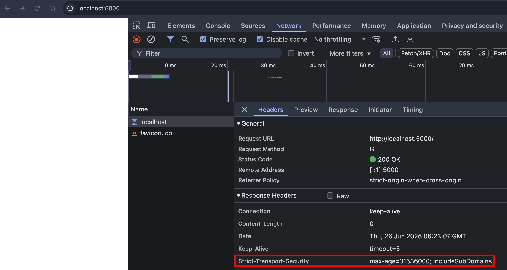
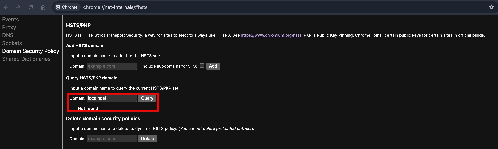
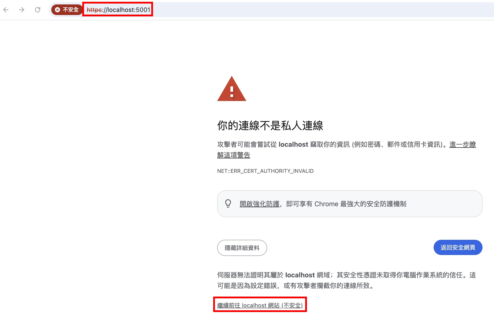
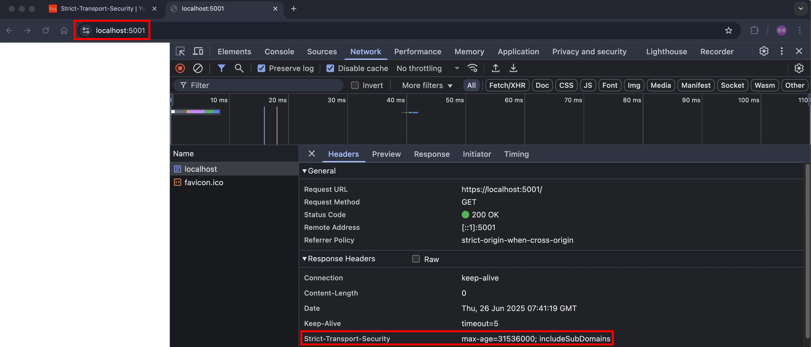
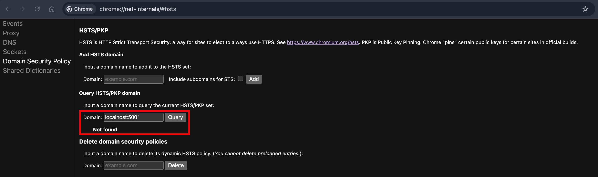
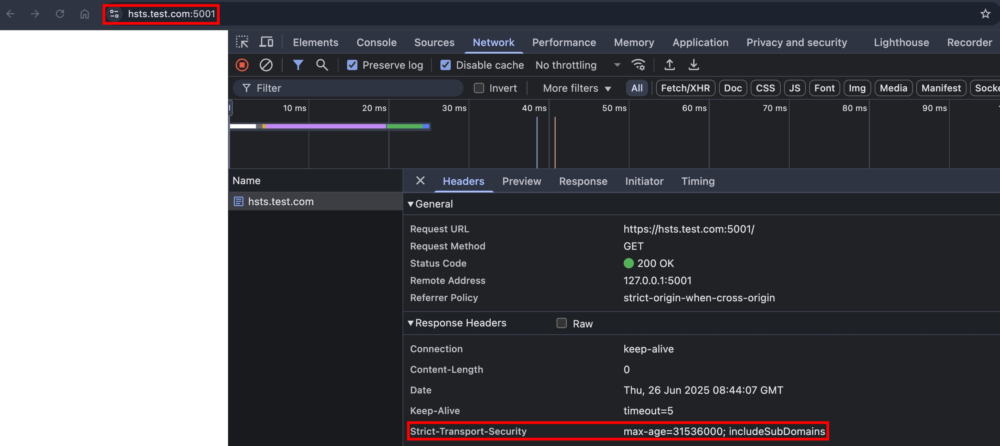
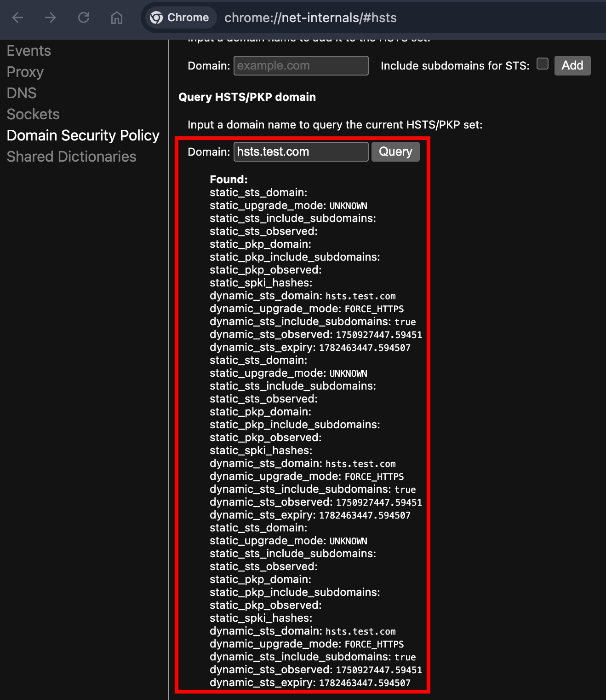

### 語法

```
Strict-Transport-Security: max-age=<seconds>
Strict-Transport-Security: max-age=<seconds>; includeSubDomains
Strict-Transport-Security: max-age=<seconds>; includeSubDomains; preload
```

### NodeJS HTTP Server

根據[MDN 文件](https://developer.mozilla.org/en-US/docs/Web/HTTP/Reference/Headers/Strict-Transport-Security#description)的描述：

```
Note: The host must send the Strict-Transport-Security header over HTTPS only, not insecure HTTP. Browsers ignore the header if sent over HTTP to prevent a manipulator-in-the-middle (MITM) from altering the header to expire prematurely or adding it for a host that doesn't support HTTPS.
```

在 HTTP Protocol 的情況設定，browser 會忽略，那我們就架一個 NodeJS HTTP Server 試試看！

index.ts

```ts
import httpServer from "../httpServer";

httpServer.removeAllListeners("request");
httpServer.on("request", function requestListener(req, res) {
  res.setHeader(
    "Strict-Transport-Security",
    "max-age=31536000; includeSubDomains",
  );
  res.end();
  return;
});
```

使用瀏覽器打開 http://localhost:5000/

恩...沒有跳任何 warning message，那我們要怎麼驗證呢？Chrome 有提供[一個頁面](chrome://net-internals/#hsts)可以查詢 HSTS（HTTP Strict Transport Security），輸入 `localhost` 以及 `localhost:5000` 查詢看看～


都沒查到！代表 Chrome 真的忽略了在 HTTP Protocol 設定的 HSTS（但我們還需要驗證在 HTTPS Protocol 是否就會紀錄 HSTS）

### NodeJS HTTPS Server

我們按照以下步驟，在本機啟動 NodeJS HTTPS Server

private-key.pem & cert.pem

```zsh
# 產生私鑰
openssl genrsa -out private-key.pem 2048

# 產生自簽憑證
openssl req -new -x509 -key private-key.pem -out cert.pem -days 365
```

httpsServer.ts

```ts
import { readFileSync } from "fs";
import { createServer } from "https";
import { join } from "path";

const httpsServer = createServer().listen(5001);
httpsServer.setSecureContext({
  key: readFileSync(join(__dirname, "private-key.pem")),
  cert: readFileSync(join(__dirname, "cert.pem")),
});
export default httpsServer;
```

index.ts

```ts
import httpsServer from "../https-server/httpsServer";

httpsServer.removeAllListeners("request");
httpsServer.on("request", function httpsRequestListener(req, res) {
  res.setHeader(
    "Strict-Transport-Security",
    "max-age=31536000; includeSubDomains",
  );
  res.end();
  return;
});
```

使用瀏覽器打開 https://localhost:5001/

恩...看來遇到了自簽憑證不被信任的問題，此時瀏覽器也不會註冊 HSTS

### mkcert 建立本機 CA

我們把剛才生成的 `private-key.pem` 跟 `cert.pem` 砍掉，並且執行

```zsh
brew install mkcert
brew install nss # to work on firefox
mkcert -install
mkcert -key-file private-key.pem -cert-file cert.pem localhost
```

然後重啟 NodeJS HTTPS Server，關閉瀏覽器，並且重開

這次沒有跳警告了，我們用 chrome://net-internals/#hsts 查查看


還是沒有！我推測有幾種可能性：

1. 瀏覽器不會紀錄 localhost 這個 host
2. chrome://net-internals/#hsts 不會立即查到剛設定的 Strict-Transport-Security

### 設定 hosts 檔案

為了逐步排查，我們先來設定本機的 hosts 檔案

```
127.0.0.1	hsts.test.com
127.0.0.1	nodejs.hsts.test.com
127.0.0.1	sub.nodejs.hsts.test.com
```

然後記得把剛才生成的 `private-key.pem` 跟 `cert.pem` 砍掉，然後重新簽憑證

```zsh
mkcert -key-file private-key.pem -cert-file cert.pem hsts.test.com nodejs.hsts.test.com sub.nodejs.hsts.test.com
```

把瀏覽器關掉重開，輸入 https://hsts.test.com:5001


成功在 Chrome 註冊 HSTS，並且查得到了！看來

### 憑證不安全的情境

根據[MDN 文件](https://developer.mozilla.org/en-US/docs/Web/HTTP/Reference/Headers/Strict-Transport-Security#description)的描述：

```
If a TLS warning or error, such as an invalid certificate, occurs when connecting to an HSTS host, the browser does not offer the user a way to proceed or "click through" the error message, which would compromise the intention of strict security.
```

### mkcert 建立本機 CA ，並生成多 domain 憑證

### disable HSTS

### chrome HSTS 管理介面

### preload 機制

根據[MDN 文件](https://developer.mozilla.org/en-US/docs/Web/HTTP/Reference/Headers/Strict-Transport-Security#expiration)的描述：

```
To disable HSTS, set max-age=0. This only takes effect once the browser makes a secure request and receives the response header. By design, you cannot disable HSTS over insecure HTTP.
```

### Best Practice

根據[MDN 文件](https://developer.mozilla.org/en-US/docs/Web/HTTP/Reference/Headers/Strict-Transport-Security#insecure_http_requests)的描述：

```
If the host accepts insecure HTTP requests, it should respond with a permanent redirect (such as status code 301) having an https URL in the Location header.
```

我觀察有一些網站，也確實會 follow 這個 best practice，所以我們就來實作一個看看吧～

### 小結

### 參考資料

- chrome://net-internals/#hsts
- https://www.chromium.org/hsts/
- https://developer.mozilla.org/en-US/docs/Web/HTTP/Reference/Headers/Strict-Transport-Security
<!-- 還沒看 -->
- https://hstspreload.org/
- https://www.rfc-editor.org/rfc/rfc6797#section-6.1
