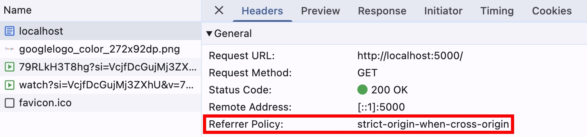
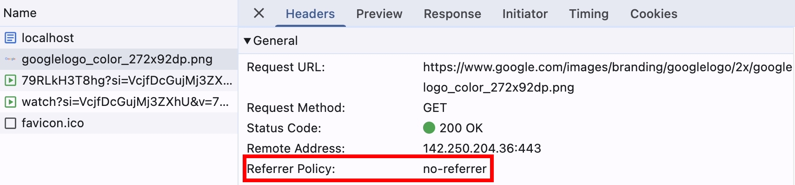
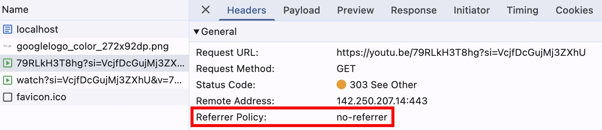

### Response Header 也能設定 referrerPolicy？

上一篇談到使用 fetch API 的參數來設定 `referrerPolicy`，現在要來談談如何從 Server Side 去設定，使用 NodeJS HTTP module 來實作簡易的 HTTP server，設定 `no-referrer`，並且載入跨域的圖片跟影片

```js
httpServer.on('request', (req, res) => {
    res.setHeader("Referrer-Policy", "no-referrer");
    res.setHeader("Content-Type", "text/html");
    res.end(`<!DOCTYPE html>
<html>
    <head></head>
    <body>
        <video src="https://youtu.be/79RLkH3T8hg?si=VcjfDcGujMj3ZXhU"></video>
        
    </body>
</html>`);
});
```

我們用瀏覽器打開 http://localhost:5000/ > F12 > Network > General，觀察 Referrer Policy：

http://localhost:5000/ ，使用瀏覽器預設的 `Referrer Policy: strict-origin-when-cross-origin` 是合理的，因為請求這個資源時，還沒收到 Server 回傳的 response header，所以使用預設值



瀏覽器後續解析 HTML，並且請求跨域的圖片跟影片，此時就會套用 Server 回傳的 `Referrer Policy: no-referrer`




### fetch API 是否也會套用 Response Header 設定的 referrerPolicy？

我們接著使用 fetch API，觀察 `Referrer Policy` 是否也變成 `no-referrer`

```js
fetch("http://localhost:5000/");
fetch("http://localhost:5000/", { method: "POST" });
fetch("https://www.google.com/");
```

可以觀察到 General > `Referrer Policy: no-referrer`，我們可以得出一個結論，當 Response Header 有設定 `Referrer Policy`，就會覆寫瀏覽器的預設值

### By Request 設定的 referrerPolicy，優先度會比較高嗎？

我們再繼續嘗試，如果在 fetch API 指定 `referrerPolicy`，這個優先級會高過 Response Header 設定的 `Referrer Policy` 嗎？

```js
fetch("http://localhost:5000/", { referrerPolicy: "origin" });
fetch("http://localhost:5000/", { referrerPolicy: "origin", method: "POST" });
fetch("https://www.google.com/", { referrerPolicy: "origin" });
```

可以觀察到 Request Headers > `referrer: http://localhost:5000/`，我們可以得出一個結論，優先順序: By 請求設定的 > Response Header 設定的 > 瀏覽器的預設值

### HTML 也能設定 referrerPolicy？

HTML meta 標籤可以設定全局的 `referrerPolicy`，作用就跟從 Response Header 設定是一樣的，我們調整一下 NodeJS 的程式碼:

```js
httpServer.on('request', (req, res) => {
    res.setHeader("Content-Type", "text/html");
    res.end(`<!DOCTYPE html>
<html>
    <head>
        <meta name="referrer" content="origin" />
    </head>
    <body>
        <video src="https://youtu.be/79RLkH3T8hg?si=VcjfDcGujMj3ZXhU"></video>
        
    </body>
</html>`);
});
```

可以看到請求圖片跟影片的 Request Headers 都有帶上 `referrer: http://localhost:5000/` 了


另外還有一些常見的 HTML 標籤也都可以 By 請求設定 `referrerPolicy`，例如 `<a>`, `` 跟 `<script>`，我們試著在 NodeJS 加入以下程式碼，並且打開 http://localhost:5000/test/?a=1&b=2

```js
httpServer.on('request', (req, res) => {
    console.log(req.headers.referer);
    res.setHeader("Content-Type", "text/html");
    res.end(`<!DOCTYPE html>
<html>
    <head>
        <meta name="referrer" content="origin" />
    </head>
    <body>
        <a href="http://localhost:5000/" target="_blank" referrerpolicy="unsafe-url">google</a>
        <a href="http://localhost:5000/" target="_blank" rel="noreferrer">google</a>
        
        <script src="https://unpkg.com/react@18/umd/react.development.js" referrerpolicy="no-referrer"></script>
    </body>
</html>`);
});
```

點擊第一個超連結時，Server Log 預期會收到

```
http://localhost:5000/test/?a=1&b=2 
http://localhost:5000/
```


第一個是 `<a href="http://localhost:5000/" target="_blank" referrerpolicy="unsafe-url">google</a>`

第二個是瀏覽器請求 favicon.ico 會吃到全局的 `<meta name="referrer" content="origin" />`

點擊第二個超連結時，Server Log 預期會收到

```
undefined
http://localhost:5000/
```

第一個是 `<a href="http://localhost:5000/" target="_blank" rel="noreferrer">google</a>`

第二個是瀏覽器請求 favicon.ico 會吃到全局的 `<meta name="referrer" content="origin" />`

`<script>` 跟 `` 也都符合預期，沒有發送 `referer`