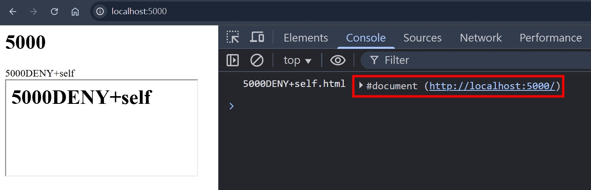

### X-Frame-Options

- 一句話總結，這個 Response Header 決定該網頁是否可以被 HTML 的 `<iframe>`, `<frame>`, `<embed>` 跟 `<object>` 嵌入
- 其中，`<frame>`, `<embed>` 跟 `<object>` 都是比較老舊的 HTMLElement，故本篇會著重在 `<iframe>`

### `<iframe sandbox>`

根據 [html.spec.whatwg.org](https://html.spec.whatwg.org/multipage/iframe-embed-object.html#attr-iframe-sandbox) 的文件描述

```
When the attribute is set, the content is treated as being from a unique opaque origin, forms, scripts, and various potentially annoying APIs are disabled, and links are prevented from targeting other navigables.
```

也就是說，當我們設定 `<iframe sandbox src="URL"></iframe>` 的時候，就會限制 `<iframe>` 內的網站行為，但我們可以透過設定多組 `allow-` 的 token 來指定被嵌入的頁面可以執行哪些事情，包含以下：

<table>
  <thead>
    <tr>
      <th>token</th>
      <th>explain</th>
    </tr>
  </thead>
  <tbody>
    <tr>
      <td>allow-downloads</td>
      <td>
        <ol>
          <li>允許透過 `<a download>` 下載檔案</li>
          <li>允許透過 `<a href="file-url">` 下載檔案</li>
          <li>允許透過 `HTMLAnchorElement.click()` 下載檔案，需先設定 `allow-scripts`</li>
        </ol>
      </td>
    </tr>
    <tr>
      <td>allow-forms</td>
      <td>
        允許 `<form action="URL">` 的執行
        <ol>
          <li>允許 `<form action="URL"></form>` 可正常送出表單</li>
          <li>允許 `<dialog><form method="dialog"></form></dialog>` 可正常關閉 dialog</li>
        </ol>
      </td>
    </tr>
    <tr>
      <td>allow-modals</td>
      <td>
        <ol>
          <li>允許 `alert()` 的執行</li>
          <li>允許 `confirm()` 的執行</li>
          <li>允許 `print()` 的執行</li>
          <li>允許 `prompt()` 的執行</li>
          <li>允許 `beforeunload` event 的執行</li>
        </ol>
        以上皆需先設定 `allow-scripts`
      </td>
    </tr>
    <tr>
      <td>allow-popups</td>
      <td>
        <ol>
          <li>允許 `open()` 的執行，需先設定 `allow-scripts`</li>
          <li>允許 `<a target="_blank">` 的執行</li>
        </ol>
      </td>
    </tr>
    <tr>
      <td>allow-same-origin</td>
      <td>
        允許瀏覽器將 "被嵌入的同源網頁" 視為同源 <br/> 
        如果嵌入的網頁為非同源，設定 `allow-same-origin` 還是會被瀏覽器視為非同源
      </td>
    </tr>
    <tr>
      <td>allow-scripts</td>
      <td>允許執行 javascript</td>
    </tr>
    <tr>
      <td>allow-top-navigation</td>
      <td>允許被嵌入的頁面可以使用 `window.top.location` 對 parent 頁面進行導轉</td>
    </tr>
    <tr>
      <td>allow-popups-to-escape-sandbox</td>
      <td>
        <ol>
          <li>允許被嵌入的頁面所開啟的新視窗（需先設定 `allow-popups`）可以跳脫 `<iframe>` 設定的 sandbox</li>
          <li>應用場景：新聞網站為了營收，透過 iframe 嵌入第三方廣告，第三方廣告頁的 "立即結帳" 會另開購物車頁面，這個購物車頁面，就可以跳脫 `<iframe>` 設定的 sandbox（可以正常執行 JavaScript => 可以正常結帳）</li>
        </ol>
      </td>
    </tr>
    <!-- todo-yus 還沒研究 -->
    <tr>
      <td>allow-top-navigation</td>
      <td>-</td>
    </tr>
    <!-- todo-yus 還沒研究 -->
    <tr>
      <td>allow-top-navigation-by-user-activation</td>
      <td>-</td>
    </tr>
    <!-- todo-yus 還沒研究 -->
    <tr>
      <td>allow-top-navigation-to-custom-protocols</td>
      <td>-</td>
    </tr>
    <!-- todo-yus 還沒研究 -->
    <tr>
      <td>allow-presentation</td>
      <td>-</td>
    </tr>
    <!-- todo-yus 還沒研究 -->
    <tr>
      <td>allow-orientation-lock</td>
      <td>-</td>
    </tr>
    <!-- todo-yus 還沒研究 -->
    <tr>
      <td>allow-pointer-lock</td>
      <td>-</td>
    </tr>
  </tbody>
</table>

<!-- ```
Blocked attempt to show beforeunload confirmation dialog on behalf of a frame with different security origin. Protocols, domains, and ports must match.
``` -->

### X-Frame-Options: DENY

不讓任何網頁嵌入

### X-Frame-Options: SAMEORIGIN

只讓同源的網頁嵌入

### CSP: frame-ancestors

比 [X-Frame-Options](#X-Frame-Options) 更新的 HTTP Response Header，可以提供更精細的控制，可設定多個白名單

### frame-ancestors 'none'

跟 [X-Frame-Options: DENY](#x-frame-options-deny) 類似，不讓任何網頁嵌入

### frame-ancestors 'self'

跟 [X-Frame-Options: SAMEORIGIN](#x-frame-options-sameorigin) 類似，只讓同源的網頁嵌入

### X-Frame-Options 跟 CSP 都沒設定的情況

- 該網頁可被任何網頁嵌入
- 遵守 [Same-origin_policy](https://developer.mozilla.org/en-US/docs/Web/Security/Same-origin_policy)
- 嵌入同源的網站，可互相存取對方的 `window`
  - parent 網站可透過 `window.frames[number]` 或 `HTMLIFrameElement.contentWindow` 存取嵌入的網站
  - 嵌入的網站則可以透過 `window.parent` 存取 parent 網站
- 嵌入跨域的網站，則瀏覽器會限制能存取的屬性
  - 若需要互相通訊，則需要透過 `window.postMessage` 以及 `addEventListener('message', callback)`
  - 確保雙方的程式接有實作對應的發送事件以及接收事件，如此就可減少未經授權的存取
  - 若嘗試在跨域的網站互相存取其對方 `window` 底下的屬性，則會被瀏覽器擋下來
  ```
  Uncaught SecurityError: Failed to read a named property 'document' from 'Window': Blocked a frame with origin "http://localhost:5001" from accessing a cross-origin frame.
  ```

### X-Frame-Options: DENY + frame-ancestors 'self'

如果同時設定這兩個，瀏覽器會以哪個為更高優先度呢？我們使用 NodeJS HTTP 模組來試試看：

NodeJS

```ts
http5000Server.on("request", function requestListener(req, res) {
  if (req.url === "/") {
    res.setHeader("Content-Type", "text/html; charset=utf-8");
    return res.end(readFileSync(join(__dirname, "5000.html")));
  }
});

http5001Server.on("request", function requestListener(req, res) {
  if (req.url === "/DENY+self") {
    res.setHeader("X-Frame-Options", "DENY");
    res.setHeader("Content-Security-Policy", "frame-ancestors 'self'");
  }
});
```

5000.html

```html
<html>
  <head></head>
  <body>
    <h1>5000</h1>
    <div>5000DENY+self</div>
    <iframe src="http://localhost:5000/DENY+self"></iframe>
  </body>
</html>
```

5000DENY+self.html

```html
<html>
  <head></head>
  <body>
    <h1>5000DENY+self</h1>
    <script>
      console.log("5000DENY+self.html", window.parent.document);
    </script>
  </body>
</html>
```

兩者都有設定的情況，CSP 的優先權會高於 `X-Frame-Options`


在 [CSP2](https://www.w3.org/TR/CSP2/#frame-ancestors-and-frame-options) 的官方文件中有描述到這點

```
The frame-ancestors directive obsoletes the X-Frame-Options header. If a resource has both policies, the frame-ancestors policy SHOULD be enforced and the X-Frame-Options policy SHOULD be ignored.
```

### X-Frame-Options 跟 CSP frame-ancestors 該怎麼設定

因為 `CSP frame-ancestors` 是比較新的功能，為了瀏覽器的向後兼容性，建議兩者都設置

如果不想讓所有網站嵌入，就設定

```ts
res.setHeader("X-Frame-Options", "DENY");
res.setHeader("Content-Security-Policy", "frame-ancestors 'none'");
```

如果只想讓同源的網站嵌入，就設定

```ts
res.setHeader("X-Frame-Options", "SAMEORIGIN");
res.setHeader("Content-Security-Policy", "frame-ancestors 'self'");
```

如果想要更精細的控制哪些網站可嵌入，就設定

```ts
res.setHeader(
  "Content-Security-Policy",
  "frame-ancestors <host-source> <host-source>",
);
```

### 參考資料

- https://developer.mozilla.org/en-US/docs/Web/HTML/Reference/Elements/iframe#sandbox
- https://developer.mozilla.org/en-US/docs/Web/HTTP/Headers/X-Frame-Options
- https://developer.mozilla.org/en-US/docs/Web/HTTP/Reference/Headers/Content-Security-Policy#self
- https://developer.mozilla.org/en-US/docs/Web/HTTP/Reference/Headers/Content-Security-Policy/frame-ancestors
- https://developer.mozilla.org/en-US/docs/Web/Security/Same-origin_policy
- https://developer.mozilla.org/en-US/docs/Glossary/Same-origin_policy
- https://www.w3.org/TR/CSP2/#frame-ancestors-and-frame-options
- https://html.spec.whatwg.org/multipage/iframe-embed-object.html#attr-iframe-sandbox
- https://aszx87410.github.io/beyond-xss/ch5/clickjacking/
